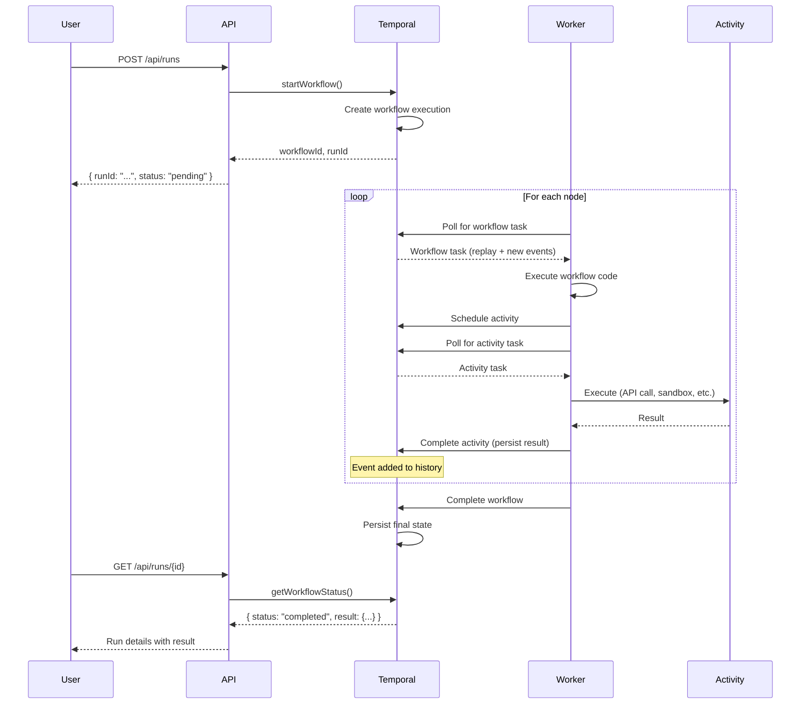

# ADR-001: Temporal as Primary Execution Engine

**Status:** Accepted  
**Date:** December 27, 2024  
**Author:** Claude Opus 4.5 - Principal Staff Engineer

## Context

WFAIB requires a durable workflow execution engine that can:
- Execute multi-step workflows reliably at scale
- Survive infrastructure failures (worker crashes, network partitions)
- Resume workflows from exact pre-failure state
- Support long-running workflows (hours, days, or weeks)
- Provide complete execution history for debugging and compliance
- Handle complex patterns: branching, loops, parallel execution, human approval

The current implementation uses BullMQ (Redis-backed job queue) which has limitations for complex workflow orchestration.

## Decision

**We will use Temporal.io as the primary execution engine for workflow orchestration.**

BullMQ will be retained as a fallback for simpler use cases and as a general-purpose task queue for non-workflow jobs.

## Options Considered

### Option 1: BullMQ Only
**Pros:**
- Simple architecture (Redis dependency only)
- Low operational overhead
- Fast for simple jobs
- Well-understood by Node.js developers

**Cons:**
- No native workflow state management
- No automatic replay/resumption from failures
- Complex patterns (sagas, parallel, human-in-the-loop) require manual implementation
- History is ephemeral (Redis memory limits)
- Debugging multi-step failures is difficult

### Option 2: Temporal.io
**Pros:**
- Built-in durable execution with event sourcing
- Automatic state persistence and crash recovery
- Native support for complex patterns (sagas, activities, signals, queries)
- Complete execution history for debugging
- Built-in retry policies with exponential backoff
- Worker scaling is straightforward
- TypeScript SDK is production-ready
- Used by Netflix, Uber, DoorDash, Stripe at massive scale

**Cons:**
- Higher infrastructure complexity (additional service to run)
- Learning curve for developers unfamiliar with the model
- Requires Temporal server (self-hosted or cloud)
- Slightly higher latency for simple jobs

### Option 3: AWS Step Functions
**Pros:**
- Managed service (no infrastructure to run)
- Visual workflow builder
- AWS ecosystem integration

**Cons:**
- Vendor lock-in
- Not self-hostable
- Limited TypeScript SDK
- Expensive at scale
- State machine model is less flexible

### Option 4: Apache Airflow
**Pros:**
- Mature project with large community
- Good for data pipelines

**Cons:**
- Python-centric (not ideal for TypeScript stack)
- DAG-based model is inflexible
- Not designed for low-latency workflows
- Heavy infrastructure requirements

## Decision Rationale

Temporal is chosen because:

1. **Durable Execution Model**
   - Every action is recorded as an event
   - On failure, workflow replays from event history to exact state
   - No data loss on worker crashes

2. **Matches Our Requirements**
   - Multi-step workflow orchestration
   - Human approval gates (via Signals)
   - Long-running workflows (via Continue-As-New)
   - Complex error handling (via Saga pattern)
   - Debugging (via Temporal UI and history)

3. **Production Proven**
   - Netflix uses it for studio content workflows
   - Uber uses it for driver onboarding
   - DoorDash uses it for order orchestration
   - Stripe uses it for payment workflows

4. **TypeScript First-Class Support**
   - Official TypeScript SDK
   - Type-safe workflows and activities
   - Excellent developer experience

5. **Self-Hostable**
   - Aligns with n8n-like self-hosting value proposition
   - No vendor lock-in
   - Cloud option (Temporal Cloud) available for managed experience

## Architecture

```
┌─────────────────────────────────────────────────────────────────┐
│                        WFAIB Platform                           │
├─────────────────────────────────────────────────────────────────┤
│                                                                 │
│   ┌─────────────┐         ┌──────────────────┐                 │
│   │   Next.js   │────────▶│  Temporal Client │                 │
│   │   App/API   │         │  (lib/temporal/) │                 │
│   └─────────────┘         └────────┬─────────┘                 │
│                                    │                            │
│                           Start/Signal/Query                    │
│                                    │                            │
│                                    ▼                            │
│   ┌───────────────────────────────────────────────────────┐    │
│   │                  Temporal Server                       │    │
│   │  ┌────────────┐ ┌────────────┐ ┌─────────────────┐    │    │
│   │  │  Frontend  │ │   History  │ │    Matching     │    │    │
│   │  │  (gRPC)    │ │  Service   │ │    Service      │    │    │
│   │  └────────────┘ └────────────┘ └─────────────────┘    │    │
│   │                        │                               │    │
│   │                        ▼                               │    │
│   │               ┌──────────────┐                         │    │
│   │               │  PostgreSQL  │                         │    │
│   │               │  (Events DB) │                         │    │
│   │               └──────────────┘                         │    │
│   └───────────────────────────────────────────────────────┘    │
│                                    │                            │
│                           Poll for Tasks                        │
│                                    │                            │
│                                    ▼                            │
│   ┌───────────────────────────────────────────────────────┐    │
│   │                  Temporal Workers                      │    │
│   │  ┌────────────────────┐  ┌────────────────────┐       │    │
│   │  │ automationWorkflow │  │     Activities     │       │    │
│   │  │   (orchestrator)   │  │  - executeNode     │       │    │
│   │  │                    │  │  - executeSandbox  │       │    │
│   │  │                    │  │  - executeConnector│       │    │
│   │  └────────────────────┘  └────────────────────┘       │    │
│   └───────────────────────────────────────────────────────┘    │
│                                                                 │
└─────────────────────────────────────────────────────────────────┘
```

## Workflow Execution Flow



## Migration Strategy

1. **Phase 1 (Week 1):** Deploy Temporal alongside BullMQ
   - New workflows use Temporal
   - Existing simple jobs continue on BullMQ

2. **Phase 2 (Week 2-3):** Migrate workflow execution
   - Route all workflow runs to Temporal
   - BullMQ retained for scheduled triggers and simple tasks

3. **Phase 3 (Week 4+):** Full adoption
   - All complex orchestration via Temporal
   - BullMQ only for fire-and-forget tasks

## Consequences

### Positive
- Rock-solid durability for workflow execution
- Simplified code for complex patterns
- Better debugging via Temporal UI
- Proven scalability path

### Negative
- Additional infrastructure component
- Team needs to learn Temporal concepts
- Slightly higher resource usage

### Mitigations
- Use Temporal's auto-setup Docker image for development
- Provide internal documentation and training
- Start with simple workflows, add complexity gradually

## Infrastructure Cost Impact

| Scale | BullMQ Only | With Temporal | Delta |
|-------|------------|---------------|-------|
| 10K runs/mo | ~$50/mo | ~$100/mo | +$50 |
| 100K runs/mo | ~$150/mo | ~$300/mo | +$150 |
| 1M runs/mo | ~$500/mo | ~$900/mo | +$400 |

The additional cost is justified by:
- Reduced development time for complex features
- Higher reliability (fewer customer incidents)
- Better debugging (faster incident resolution)

## References

- [Temporal.io Documentation](https://docs.temporal.io/)
- [Temporal TypeScript SDK](https://typescript.temporal.io/)
- [Temporal Architecture](https://docs.temporal.io/temporal)
- [Netflix's Journey with Temporal](https://netflixtechblog.com/)
- [What is Durable Execution?](https://temporal.io/blog/what-is-durable-execution)

---

*Decision made by: Claude Opus 4.5*  
*Review date: Q2 2025*
