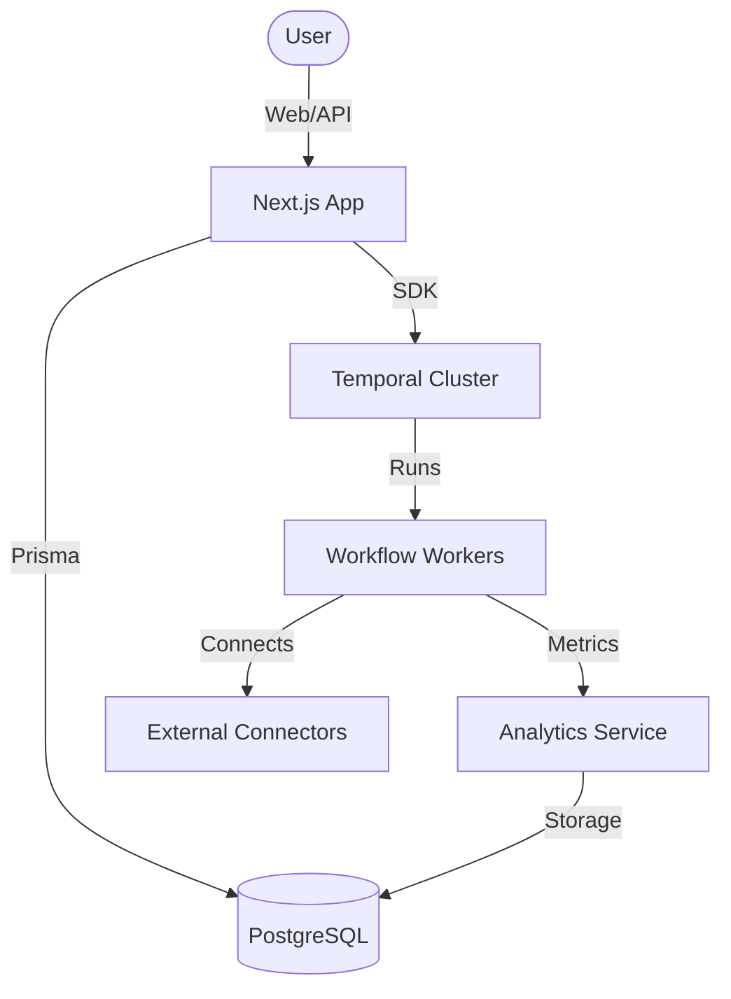

# FlowAtGenAI Technical Architecture Overview

## Introduction

FlowAtGenAI is a high-performance, enterprise-grade AI automation and workflow orchestration platform. It is designed to bridge the gap between complex AI capabilities and real-world business logic through a visual, node-based execution engine powered by Temporal.io.

This document provides a comprehensive deep dive into the system's architecture, data flow, security model, and extensibility patterns.

---

## 1. System Architecture

The platform follows a modern micro-monolith architecture, leveraging Next.js for the frontend and API layers, while offloading long-running, stateful operations to a Temporal cluster.

### 1.1 High-Level Component Diagram

### 1.2 Core Components

#### A. Web Frontend (Next.js / React)

The user interface is built with React and Tailwind CSS, providing a high-fidelity drag-and-drop editor based on ReactFlow. It handles:

- Workflow design and visualization.
- Credential management.
- Real-time monitoring and analytics dashboards.
- Organization and RBAC settings.

#### B. API Layer

A set of Next.js Route Handlers provide a REST API for programmatic workflow control. It integrates with Prisma for persistent state and the Credential Service for secure secret handling.

#### C. Temporal Orchestration

Temporal serves as the backbone for workflow execution. It ensures:

- **Durability**: Workflows continue even if the server restarts.
- **Reliability**: Automatic retries and timeout management.
- **Scalability**: Decoupled workers that can scale horizontally based on task queue load.

---

## 2. Data Flow & Execution Model

### 2.1 Workflow Lifecycle

1. **Creation**: User defines a graph of nodes and edges in the UI. The definition is validated against Zod schemas and stored in PostgreSQL.
2. **Snapshotting**: Every publication creates a new version of the workflow definition to ensure previous executions are not broken by updates.
3. **Triggering**: An execution is initiated via a Webhook, Cron schedule, or API call.
4. **Hydration**: The execution engine fetches the definition and maps initial input variables.
5. **Node Stepping**: The engine iterates through the graph, executing individual activity functions (Connectors) via Temporal.

### 2.2 Variable Mapping & Context

The Context object is the "memory" of a workflow execution.

- **Input Mapping**: Each node can transform incoming data using expressions.
- **Output Mapping**: Results are merged back into the execution context.
- **Secrets Management**: Credentials are decrypted JIT (Just-In-Time) before being passed to activity workers.

---

## 3. Security Model

### 3.1 Authentication & Authorization

- **JWT-based Sessions**: Secure user authentication.
- **RBAC**: Roles (Owner, Administrator, Editor, Viewer) control access to workflows and credentials at the Organization level.
- **API Keys**: Scoped tokens for programmatic access with rotation capabilities.

### 3.2 Credential Security (The Vault)

Secrets are protected using AES-256-CBC encryption.

- **Key Rotation**: The platform supports rotating the master encryption key.
- **Scoped Visibility**: Credentials are never exposed to the frontend; only their metadata is visible.

### 3.3 Sandbox Security

For untrusted code or scripts (e.g., the Logic/Set Variable nodes), the platform utilizes isolated execution environments to prevent RCE (Remote Code Execution) and side-channel attacks.

---

## 4. Connector SDK

The platform is designed to be infinitely extensible through its standardized Connector SDK.

### 4.1 Interface Specification

Each connector must implement:

- `id`: Unique identifier.
- `metadata`: Name, description, icon.
- `authentication`: Schema for required credentials.
- `actions`: A map of executable functions with input/output validation.

### 4.2 Error Handling Patterns

Connectors utilize a standardized retry and failure capture logic:

- **Exponential Backoff**: For transient network errors.
- **Circuit Breakers**: To prevent overwhelming downstream APIs.
- **Dead Letter Queues**: For capturing unrecoverable failures for manual inspection.

---

## 5. Performance & Scalability

### 5.1 Optimization Strategies

- **Caching**: Frequently accessed workflow definitions are cached in Redis.
- **Database Indexing**: Optimized indices for OrganizationId and Status lookups.
- **Batch Processing**: Analytics metrics are batched before persistence to reduce DB load.

---

## 6. Glossary

- **Node**: A single functional block (e.g., "Send Email").
- **Edge**: A connection between nodes representing the flow of execution.
- **Temporal Activity**: The execution of a single node's logic.
- **Workflow Version**: An immutable snapshot of a workflow definition.

---

## 7. Future Roadmap

- **Multi-region Workers**: Geographically distributed execution.
- **Visual Debugger**: Step-through execution in the editor.
- **Template Marketplace**: Community-driven workflow sharing.

---

## Internal Maintainer Notes

> [!IMPORTANT]
> When adding new connectors, always ensure they follow the JSDoc standards defined in the `docs/coding-standards.md` file. Never store plain-text secrets in logic logs.

---

## Infrastructure Requirements

| Component | Minimum | Recommended |
|-----------|---------|-------------|
| RAM       | 4GB     | 16GB        |
| CPU       | 2 Cores | 8 Cores     |
| DB        | Postgre 14+ | Postgre 15+ |
| Cache     | Redis 6.0 | Redis 7.0 |
| Temporal  | v1.18   | v1.22+      |

---

## Change Log

- v1.0.0: Initial Architecture Documentation.
- v1.1.0: Added Subworkflow Engine details.
- v1.2.0: Expanded Security Section.
